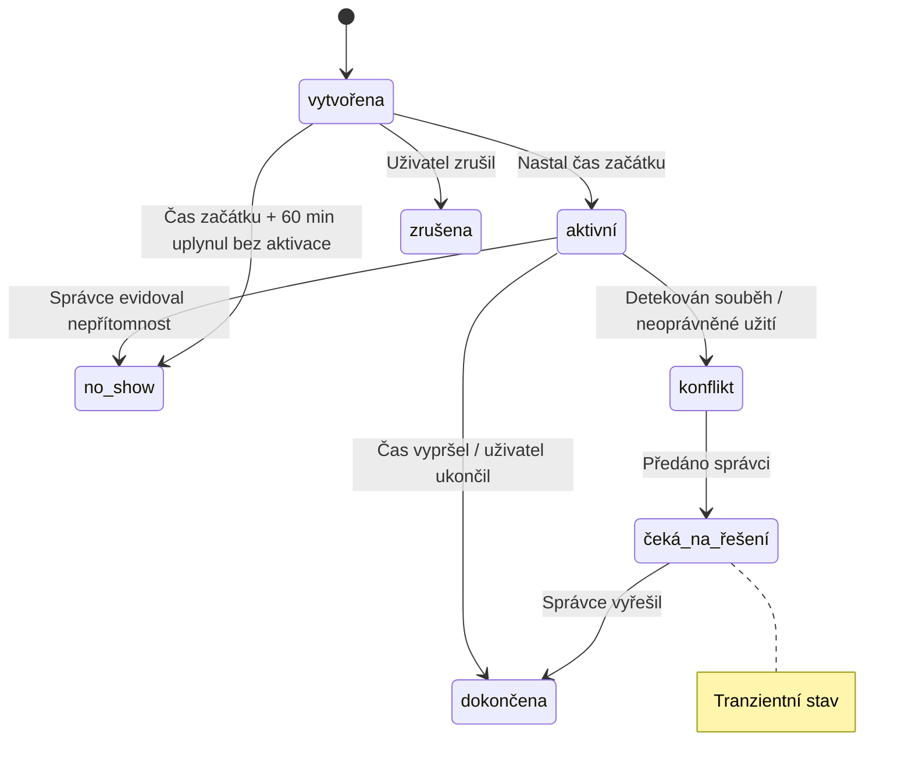
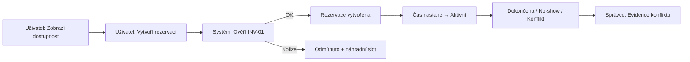
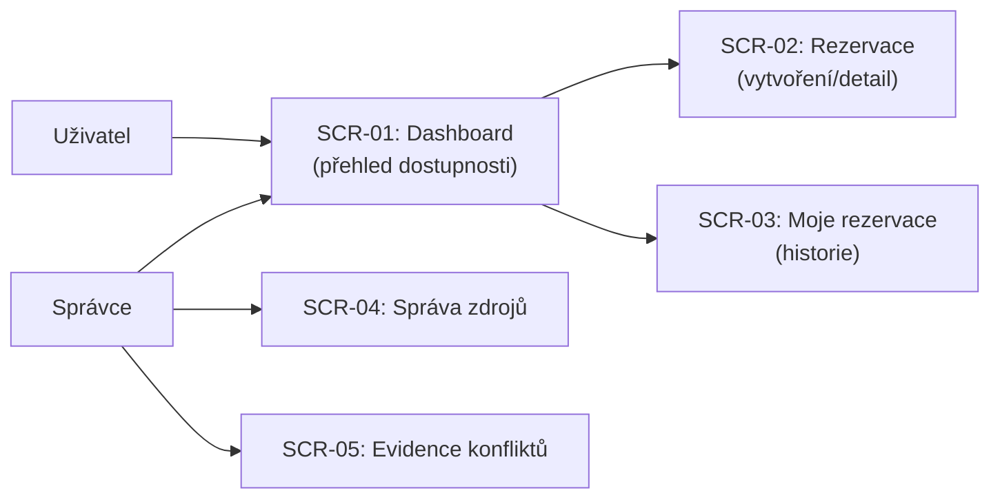
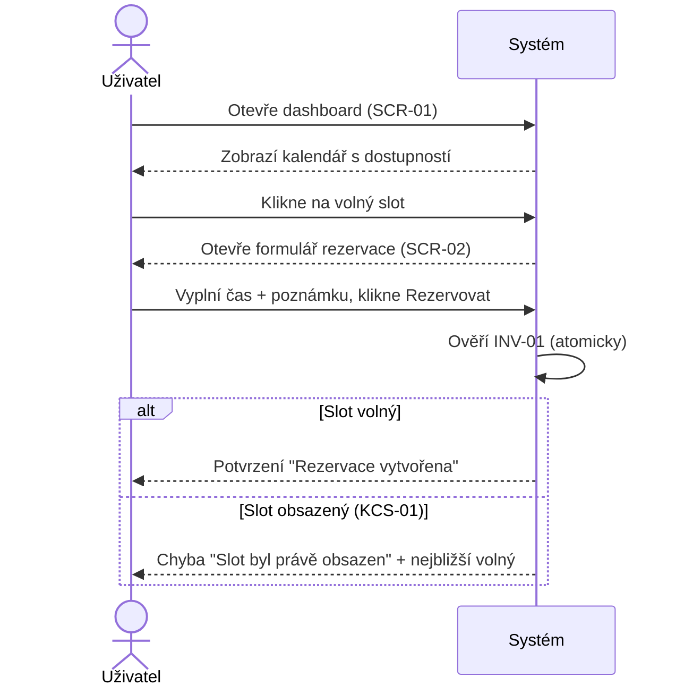
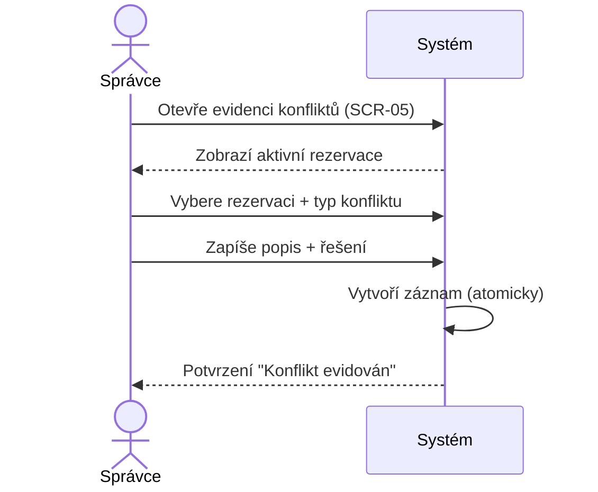

# PAB — Product Architecture Baseline — Rezervace sdílených zdrojů
## Verze: v1 | Tier: Lean | Projekt: Rezervace_zdroju
## Status: Revidováno Oponentem — FINÁLNÍ

---

## Kapitola 1 — Strategický rámec

### Problém
Malý hybridní tým (10–20 lidí) sdílí omezené fyzické zdroje (zasedačky, služební auto, zařízení). Neexistuje jednotný zdroj pravdy o dostupnosti zdrojů — koordinace probíhá přes osobní domluvu a nekonzistentní záznamy v kalendáři. Důsledkem jsou konflikty (dvojité rezervace, no-shows, neoprávněné užití), které stojí tým v průměru 25 minut na incident při frekvenci 3.5 incidentu měsíčně.

### Primární aktéři
- **Uživatel (End-User):** Člen týmu, který potřebuje zdroj pro svou práci. Chce vidět dostupnost a rezervovat jednoduše.
- **Správce (Admin):** Office manager, který řeší konflikty a dohlíží na využití. Aktuálně investuje 2–3 hodiny týdně do řešení sporů.

### Hodnota vs. ztráta
- Hodnota: Eliminace konfliktů, úspora času (správce: 1–2h/týden, uživatelé: 25 min/incident), eliminace finančních ztrát (taxi náhradou za obsazené auto)
- Ztráta při neřešení: Eskalující frustrace (aktuálně 4.0/5), narůstající neformální pravidla, ztráta důvěry v systém sdílení

### Současný workaround
Kalendář + osobní domluva. Prokazatelně selhává u všech typů zdrojů — nikdo nevidí kolize, zařízení mizí bez evidence.

### Trigger ke změně
Frustrace dosáhla bodu, kdy tým sám inicioval potřebu řešení. Concierge Pilot (Google Sheet) potvrdil 71 % adopci bez vnější motivace.

### Context of Use & Platforms
Hybridní práce — uživatelé potřebují přístup z kanceláře i z domova. Mobilní přístup silně preferován.

**Assumptions:**
- Tým zůstane v rozsahu 10–20 lidí
- Zdroje jsou fyzické a sdílené

**Decision Log:**
- DL-01: Dvě role (uživatel, správce) — validováno interviews

**Confidence & Gaps:**
- Confidence: Vysoká (validováno 7 respondenty + Concierge Pilotem)
- Gap: Míra vynucení pravidel — zákazník sám neví, jak přísná mají být

---

## Kapitola 2 — Architektura systému

### Ubiquitous Language

| Pojem | Definice |
|-------|---------|
| Zdroj | Sdílený fyzický prostředek (zasedačka, auto, zařízení), který lze rezervovat na konkrétní čas. |
| Rezervace | Časově ohraničený nárok uživatele na konkrétní Zdroj. Má životní cyklus. |
| Konflikt | Situace, kdy dva nebo více nároků na stejný Zdroj ve stejném čase kolidují, nebo reálné užití neodpovídá Rezervaci. |
| No-show | Stav, kdy Uživatel má aktivní Rezervaci, ale Zdroj ve skutečnosti nepoužívá. |
| Neoprávněné užití | Stav, kdy někdo používá Zdroj bez platné Rezervace. |
| Uživatel | Člen týmu, který rezervuje a používá sdílené Zdroje. |
| Správce | Osoba zodpovědná za správu Zdrojů, řešení Konfliktů a definici pravidel. |

### Core Job systému
Poskytnout jednotný zdroj pravdy o dostupnosti sdílených zdrojů a deterministicky řešit situace, kdy realita neodpovídá plánu.

### Roles & Permissions

**Uživatel:**
- Může: zobrazit dostupnost, vytvořit/zrušit vlastní rezervaci, zobrazit vlastní historii, nahlásit konflikt
- Nemůže: spravovat zdroje, řešit cizí konflikty, mazat cizí rezervace

**Správce:**
- Může: vše co uživatel + přidávat/odebírat zdroje, řešit konflikty, evidovat no-show/neoprávněné užití, zobrazit historii všech
- Nemůže: mazat historii evidence (auditní stopa je neměnná)

### System Boundary
Systém řeší POUZE evidenci a koordinaci sdílených fyzických zdrojů uvnitř jednoho týmu. Neřeší finance, integrace s externími kalendáři, ani automatické penalizace.

### Source of Truth (SoT)

| Doména | Source of Truth | Poznámka |
|--------|----------------|----------|
| Dostupnost zdroje | Systém (seznam rezervací) | Kalendář přestává být relevantní |
| Kdo zdroj aktuálně používá | Systém (aktivní rezervace) | Dnes nikdo neví |
| Řešení konfliktu | Správce (rozhodnutí v systému) | Evidováno s důvodem |
| Definice zdrojů | Správce (správa v systému) | Uživatel nemůže přidávat |

### Non-Functional Requirements
- NFR-01: Systém musí být jednoduchý — uživatelé odmítnou složitý systém (z VP)
- NFR-02: Mobilní přístup je silně preferován (z VP)

### Integrace
Žádné integrace v MVP. Out of scope: Google Calendar, push notifikace.

### Core Entities

**Zdroj:**
- Atributy: id, název, typ (zasedačka/auto/zařízení), stav (aktivní/neaktivní), popis
- Vztahy: has_many Rezervace

**Rezervace:**
- Atributy: id, zdroj_id, uživatel_id, od (datetime), do (datetime), stav, poznámka
- Vztahy: belongs_to Zdroj, belongs_to Uživatel, may_have Konflikt

**Konflikt:**
- Atributy: id, typ (dvojitá_rezervace/no_show/neoprávněné_užití), popis, stav (otevřený/vyřešený), řešení, řešitel_id, vytvořeno, vyřešeno
- Vztahy: belongs_to Rezervace, resolved_by Správce

### Stavový model — Rezervace



**Neplatné přechody:**
- dokončena → vytvořena (dokončená rezervace se nemůže vrátit)
- zrušena → aktivní (zrušená rezervace se nemůže reaktivovat)

### Rozhodovací body
- Kdo má přednost při souběhu? → Správce rozhodne (manual_escalation)
- Co se stane při no-show? → Správce eviduje, zdroj se uvolní
- Jak přísná pravidla? → MVP: měkká (evidence, ne penalizace)

### Known Critical Situations

**KCS-01: Souběh dvou rezervací na stejný zdroj (race condition)**
Dva uživatelé současně vytvářejí rezervaci na stejný zdroj ve stejném čase.
- **Resolution type:** preventive_guard
- **Rozhodovací pravidlo:** First-come-first-served — systém povolí první požadavek a druhý odmítne s informací o kolizi.
- **Guarding invariant:** INV-01
- **Transient state:** N/A (prevence, ne řešení)
- **Audit:** false (systém zamezí vzniku)

**KCS-02: No-show — uživatel nepřijde na rezervaci**
Uživatel má aktivní rezervaci, ale zdroj nepoužívá. Zdroj je blokovaný.
- **Resolution type:** manual_escalation
- **Escalation path:** Správce
- **Escalation SLA:** 60 minut po začátku rezervace
- **Fallback if timeout:** Rezervace automaticky přejde do stavu no_show, zdroj se uvolní.
- **Guarding invariant:** INV-02
- **Transient state:** čeká_na_řešení
- **Audit:** true

**KCS-03: Neoprávněné užití — někdo používá zdroj bez rezervace**
Legitimní rezervant přijde a zdroj je obsazený neoprávněným uživatelem.
- **Resolution type:** manual_escalation
- **Escalation path:** Správce
- **Escalation SLA:** 30 minut
- **Fallback if timeout:** Neoprávněný uživatel musí zdroj uvolnit, konflikt evidován.
- **Guarding invariant:** INV-03
- **Transient state:** čeká_na_řešení
- **Audit:** true

**KCS-04: Správce řeší konflikt — komu dát přednost**
Dva legitimní nároky na stejný zdroj, kde automatické pravidlo nestačí (např. oba mají platnou rezervaci kvůli chybě).
- **Resolution type:** manual_escalation
- **Escalation path:** Správce
- **Escalation SLA:** 120 minut
- **Fallback if timeout:** Starší rezervace má přednost (first-come-first-served fallback).
- **Guarding invariant:** INV-04
- **Transient state:** čeká_na_řešení
- **Audit:** true

### Invariants

| ID | Invariant | Důsledek porušení |
|----|-----------|-------------------|
| INV-01 | Zdroj nesmí mít dvě překrývající se rezervace (stav "vytvořena" NEBO "aktivní") ve stejném čase. | Systém odmítne druhou rezervaci. |
| INV-02 | Rezervace ve stavu no_show musí uvolnit zdroj do 60 minut od začátku. | Automatický přechod do no_show + uvolnění. |
| INV-03 | Každé užití zdroje musí mít přiřazenou platnou rezervaci. | Neoprávněné užití → konflikt → evidence. |
| INV-04 | Každý konflikt musí skončit v definovaném stavu (vyřešený). | Fallback po SLA timeout. |
| INV-05 | Historie evidence (konflikty, no-shows) je neměnná — nelze ji mazat. | Správce nemůže smazat auditní záznamy. |

### System-Level Rules (Lean verze)

1. Systém musí evidovat nesoulad mezi systémy (nikdy ho tiše neřešit).
2. Každý proces musí skončit definovaným stavem (i při selhání).

### System Rules

**Session & Access:**
- Přihlášení vyžadováno pro všechny operace
- Role se odvozuje z přiřazení v systému (uživatel/správce)

**Default behavior:**
- Nová rezervace: stav "vytvořena"
- Čas v UTC, zobrazení v lokálním čase
- Časové sloty: pevné intervaly (30 min nebo 1h)

**Co systém nikdy nebude dělat:**
- Automaticky penalizovat za no-show (pouze evidence)
- Řešit finance
- Integrovat se s externími systémy

**Assumptions:**
- Tým používá systém dobrovolně
- Správce kontroluje stav pravidelně (minimálně denně)

**Decision Log:**
- DL-04: Měkká pravidla v MVP (evidence, ne penalizace)
- DL-05: First-come-first-served jako výchozí pravidlo pro souběh

**Confidence & Gaps:**
- Confidence: Střední (KCS-01 race condition závisí na implementaci)
- Gap: Budoucí automatizace no-show detekce (IoT senzory, check-in)

---

## Kapitola 2.5 — Interakční kontrakty

### UC-01: Zobrazit dostupnost zdroje

**Aktér & Trigger:** Uživatel otevírá přehled dostupnosti
**Preconditions:** Uživatel je přihlášen
**Vstup (Data Payload):** zdroj_id (volitelné — pokud nevybráno, zobrazí všechny), datum_od, datum_do
**Výstup (Data Payload):** seznam_zdrojů[{id, název, typ, sloty[{od, do, stav, rezervoval}]}]

**Main flow:**
1. Uživatel otevře přehled dostupnosti.
2. Systém načte seznam zdrojů a jejich rezervace pro zvolený rozsah.
3. Systém zobrazí kalendářový přehled s barevným rozlišením (volný/obsazený/konflikt).
4. Uživatel může filtrovat podle typu zdroje.

**Error flows:**
1.1. Žádné zdroje nejsou definovány → systém zobrazí prázdný stav s informací "Správce zatím nepřidal žádné zdroje."

**Validace:** Datum_od musí být ≤ datum_do.
**Side effects:** Žádné (read-only operace).

---

### UC-02: Vytvořit rezervaci ★ (Skin in the Game)

**Aktér & Trigger:** Uživatel chce rezervovat zdroj na konkrétní čas
**Preconditions:** Uživatel je přihlášen, zdroj existuje, slot je volný
**Vstup (Data Payload):** zdroj_id, od (datetime), do (datetime), poznámka (volitelná)
**Výstup (Data Payload):** rezervace_id, stav ("vytvořena"), potvrzení

**Main flow:**
1. Uživatel vybere zdroj a časový slot.
2. Systém ověří, že slot NENÍ obsazený jinou rezervací ve stavu "vytvořena" nebo "aktivní" (INV-01). Kontrola zahrnuje OBA stavy — i budoucí rezervace blokují slot.
3. Systém vytvoří rezervaci ve stavu "vytvořena".
4. Systém zobrazí potvrzení s detaily rezervace.

**Error flows:**
2.1. Slot je obsazený (INV-01 porušen) → systém odmítne s informací "Zdroj je v tomto čase obsazený. Rezervoval: [jméno], [čas]." → nabídne nejbližší volný slot.
2.2. Souběh (KCS-01) → first-come-first-served, pozdější požadavek odmítnut.

**Validace:**
- od < do (čas konce musí být po začátku)
- od ≥ aktuální čas (nelze rezervovat do minulosti)
- od ≤ aktuální čas + 14 dní (nelze rezervovat více než 14 dní dopředu — zamezení dlouhodobého blokování)
- Délka rezervace: min 30 min, max 8h

**Side effects:** Slot se obsadí, ostatním uživatelům se zobrazí jako "obsazený".

---

### UC-03: Zrušit rezervaci

**Aktér & Trigger:** Uživatel ruší svou existující rezervaci
**Preconditions:** Rezervace existuje, patří uživateli, stav je "vytvořena" nebo "aktivní"
**Vstup (Data Payload):** rezervace_id
**Výstup (Data Payload):** potvrzení zrušení, uvolněný slot

**Main flow:**
1. Uživatel vybere svou rezervaci.
2. Systém ověří, že rezervace patří uživateli a je ve stavu "vytvořena" nebo "aktivní".
3. Systém změní stav na "zrušena".
4. Slot se uvolní pro ostatní.

**Error flows:**
2.1. Rezervace nepatří uživateli → systém odmítne "Nemůžeš zrušit cizí rezervaci."
2.2. Rezervace je ve stavu "dokončena" nebo "zrušena" → systém odmítne "Tato rezervace už byla ukončena."

**Validace:** Pouze vlastní rezervace. Správce může zrušit libovolnou.
**Side effects:** Slot se uvolní.

---

### UC-04: Evidovat konflikt (no-show / neoprávněné užití)

**Aktér & Trigger:** Správce eviduje zjištěný problém
**Preconditions:** Správce je přihlášen, existuje aktivní rezervace nebo zdroj je v užití
**Vstup (Data Payload):** typ_konfliktu (no_show | neoprávněné_užití | dvojitá_rezervace), rezervace_id (volitelné), popis, řešení
**Výstup (Data Payload):** konflikt_id, stav ("vyřešený"), evidence v historii

**Main flow:**
1. Správce identifikuje problém (no-show nebo neoprávněné užití).
2. Správce otevře formulář evidence konfliktu.
3. Správce vybere typ a zapíše popis + řešení.
4. Systém vytvoří záznam konfliktu a přiřadí k relevantní rezervaci.
5. Pokud no-show: systém změní stav rezervace na "no_show" a uvolní zdroj.
6. Pokud neoprávněné užití: systém eviduje, zdroj zůstává legitimnímu rezervantovi.

**Error flows:**
4.1. Správce nevyplnil povinná pole → systém upozorní "Vyplňte typ konfliktu a popis."
4.2. Dotčená rezervace je ve stavu "dokončena" nebo "zrušena" → systém nabídne: "Rezervace již byla ukončena. Chcete evidovat jako historický záznam?" → Pokud ano, konflikt se vytvoří s příznakem `historický = true`.

**Validace:** Typ konfliktu je povinný. Popis je povinný (min 10 znaků).
**Side effects:** Auditní záznam vytvořen (INV-05 — neměnný).

---

### UC-05: Spravovat zdroje

**Aktér & Trigger:** Správce přidává, upravuje nebo deaktivuje zdroj
**Preconditions:** Správce je přihlášen
**Vstup (Data Payload):** název, typ (zasedačka/auto/zařízení), popis (volitelný)
**Výstup (Data Payload):** zdroj_id, stav (aktivní/neaktivní)

**Main flow:**
1. Správce otevře správu zdrojů.
2. Správce přidá nový zdroj (název, typ) nebo upraví existující.
3. Systém uloží změnu.

**Error flows:**
2.1. Správce se pokusí smazat zdroj s aktivními rezervacemi → systém odmítne "Zdroj má aktivní rezervace. Nejprve je zrušte nebo počkejte na dokončení."

**Validace:** Název je povinný, unikátní.
**Side effects:** Nový zdroj se zobrazí v přehledu dostupnosti.

---

**Assumptions (Kap. 2.5):**
- 5 Use Casů pokrývá celý Lean scope
- UC-02 je Skin in the Game — hlavní akce v systému

**Decision Log:**
- DL-06: Správce může zrušit libovolnou rezervaci (ne jen vlastní)
- DL-07: Evidence konfliktu vyžaduje popis (min 10 znaků) — pro auditní kvalitu

**Confidence & Gaps:**
- Confidence: Vysoká
- Gap: Automatická detekce no-show (v MVP manuální)

---

## Kapitola 3 — Rozsah a priority

### IN MVP
- UC-01: Zobrazit dostupnost zdroje
- UC-02: Vytvořit rezervaci
- UC-03: Zrušit rezervaci
- UC-04: Evidovat konflikt
- UC-05: Spravovat zdroje

### OUT of MVP
- Integrace s Google Calendar
- Push notifikace
- Automatické penalizace za no-show
- Reporting a statistiky využití
- Finanční moduly
- Automatická detekce no-show (IoT/check-in)

### Zjednodušení
- Jeden tým, jeden tenant
- Zdroje předdefinované správcem
- Časové sloty v pevných intervalech (30 min nebo 1h)

**Assumptions:**
- MVP pokrývá core potřebu validovanou v terénním výzkumu
- Rozšíření je možné přes `/propagate`

**Decision Log:**
- DL-02: Bez financí — explicitní požadavek zákazníka
- DL-03: Bez integrací — explicitní požadavek zákazníka

**Confidence & Gaps:**
- Confidence: Vysoká

---

## Kapitola 4 — Mapa toků (Lean: zkrácená)

Systém je dostatečně přehledný bez detailní vizualizace (5 UC, 2 role, lineární flow). Hlavní tok:



**Confidence & Gaps:**
- Flow je lineární, bez složitých větvení

---

## Kapitola 5 — MVP logistika (Lean: zkrácená)

- **Pilotní skupina:** Celý tým (10–20 lidí) — validováno Concierge Pilotem
- **Rozsah dat:** 3–5 zdrojů (2 zasedačky, 1 auto, 1–2 zařízení)
- **KPI:** (1) Počet konfliktů/měsíc < 1 (dnes 3.5), (2) Adopce > 70 %, (3) Čas řešení konfliktu < 5 min

**Confidence & Gaps:**
- Confidence: Vysoká (KPI odvozeny z VP dat)

---

## Kapitola 6 — Rizika (Lean: zkrácená)

| Riziko | Pravděpodobnost | Dopad | Mitigace |
|--------|-----------------|-------|----------|
| Nízká adopce (uživatelé se vrátí ke kalendáři) | Střední | Vysoký | Jednoduché UI, mobilní přístup |
| Správce nestíhá řešit konflikty | Nízká | Střední | Fallback s timeout (automatické uvolnění) |
| Race condition při souběžné rezervaci | Nízká | Vysoký | INV-01 + preventive guard |

**DODATEK — Behaviorální selhání:**
- Uživatel rezervuje "preventivně" (blokuje slot, který nepotřebuje) → Lean: řeší správce manuálně
- Uživatel zapomene zrušit → No-show flow (KCS-02)

**Confidence & Gaps:**
- Gap: Škálování nad 20 lidí (mimo scope)

---

## Self-check

- [x] Všech 6 kapitol přítomno (1, 2, 2.5, 3, 4, 5, 6)
- [x] Kap. 1 a 3 odpovídají Core Designerovi
- [x] Kap. 2 obsahuje všechny podsekce
- [x] Stavový model s tranzientními stavy a neplatnými přechody
- [x] Kap. 2.5: 5 UC s Data Payloady a NUMBERED LISTS
- [x] UC-02 je Skin in the Game
- [x] Kap. 6 obsahuje DODATEK
- [x] Každá kapitola má Assumptions, Decision Log, Confidence & Gaps
- [x] Žádné implementační detaily
- [x] Lean limity dodrženy: 5 INV, 4 KCS, 5 UC, 2 System-Level Rules
- [x] Každá KCS má Decision Strategy

---

## Oponent — Decision Log (PAB Review)

| # | Nález | Typ | Oprava |
|---|-------|-----|--------|
| OPP-01 | Chybí max_advance limit pro rezervace (blokování na měsíce) | PAB_CHANGE | Přidáno: max 14 dní dopředu + validace + microcopy |
| OPP-02 | UC-04 chybí error flow pro dokončenou rezervaci | PAB_CHANGE | Přidáno: error flow 4.2 s historickým záznamem |
| OPP-03 | INV-01 nespecifikuje kontrolu stavu "vytvořena" | PAB_CHANGE | Upřesněno: INV-01 kontroluje "vytvořena" i "aktivní" |
| OPP-04 | SCR-01 DataCard chybí vazba na poznámku | PRD_ONLY | Přidáno: Rezervace.poznámka do DataCard |
| OPP-05 | Chybí přechod vytvořena → no_show | PAB_CHANGE | Přidáno: přechod s triggerem "čas + 60 min bez aktivace" |

**Structural Check:**
- [x] Boundary: IN/OUT MVP jasně definováno
- [x] State model: Kompletní s tranzientními stavy (včetně nového přechodu)
- [x] Concurrency: KCS-01 pokrývá race condition s preventive_guard
- [x] Trust: Role odděleny, správce nemůže mazat historii
- [x] MVP scope: 5 UC, žádný scope creep
- [x] Invariants: 5 INV, všechny s důsledkem porušení
- [x] Decision Layer: Všechny KCS mají decision_strategy

**Stav: FINÁLNÍ** — PAB je schválený baseline pro UAT a PRD.

---

# ČÁST 2 — PROJECT DESIGN

## Kapitola 7 — Design Decisions & Technical Constraints

### 7.0 Design Strategy & Context of Use

Hybridní tým (kancelář + remote) s mobilním přístupem jako prioritou. Design musí:
- Fungovat plně na mobilu (responsive-first)
- Být extrémně jednoduchý (adopce 71 % bez motivace — nesmíme ji ztratit složitostí)
- Poskytovat okamžitý vizuální feedback (volný/obsazený slot na první pohled)
- Minimalizovat počet kroků k rezervaci (max 3 tapy na mobilu)

### 7.1 Critical Interactions

**KCS-01: Souběh dvou rezervací na stejný zdroj**
- **Trigger:** Dva uživatelé kliknou "Rezervovat" na stejný slot ve stejnou chvíli
- **Konflikt:** Oba vidí slot jako volný, oba odešlou požadavek
- **Rozhodovací pravidlo:** preventive_guard — first-come-first-served. Systém na úrovni backendu zamkne slot atomicky. Pozdější požadavek dostane chybu "Slot byl právě obsazen. Zobrazuji nejbližší volný."
- **Deterministický výsledek:** Vždy právě jedna rezervace. Žádný nedeterministický stav.

**KCS-02: No-show**
- **Trigger:** Uplynulo 60 minut od začátku rezervace, uživatel nepřišel
- **Konflikt:** Zdroj je blokovaný, ale nepoužívaný
- **Rozhodovací pravidlo:** Správce manuálně eviduje no-show. Po 60 min SLA bez akce správce → automatický přechod do no_show, zdroj uvolněn.
- **Deterministický výsledek:** Rezervace → no_show, zdroj volný.

**KCS-03: Neoprávněné užití**
- **Trigger:** Uživatel přijde a zdroj je obsazený někým bez rezervace
- **Konflikt:** Legitimní rezervant vs. neoprávněný uživatel
- **Rozhodovací pravidlo:** Správce rozhodne. SLA 30 min. Fallback: neoprávněný musí uvolnit.
- **Deterministický výsledek:** Konflikt evidován, zdroj předán rezervantovi.

**KCS-04: Správce řeší přidělení**
- **Trigger:** Dva legitimní nároky, automatické pravidlo nestačí
- **Konflikt:** Kdo dostane zdroj?
- **Rozhodovací pravidlo:** Správce rozhodne. SLA 120 min. Fallback: starší rezervace vyhrává.
- **Deterministický výsledek:** Jeden dostane zdroj, druhý nabídku alternativy.

### 7.2 Time Semantics

- **Zdroj času:** Server UTC. Klient zobrazuje lokální čas.
- **Přesnost:** Minuty (ne sekundy). Sloty v 30min nebo 1h intervalech.
- **Hraniční podmínky:** Rezervace od 10:00 do 11:00 znamená >= 10:00 a < 11:00 (exkluzivní konec). Nová rezervace od 11:00 je validní.
- **Kdy se pravidlo vyhodnocuje:** INV-01 se kontroluje při CREATE. INV-02 (no-show timeout) se vyhodnocuje kontinuálně (cron nebo event-driven).

### 7.3 Atomic Operations

**Vytvoření rezervace (UC-02):**
- **Co probíhá:** Ověření dostupnosti + zápis rezervace
- **Je atomická:** ANO — check + insert musí být v jedné transakci (race condition prevence)
- **Co se stane při selhání:** Žádná rezervace nevznikne, uživatel vidí chybu
- **Idempotentní:** NE — opakovaný submit vytvoří duplikát → nutný guard (disable button po submitu)

**Evidence konfliktu (UC-04):**
- **Co probíhá:** Zápis konfliktu + změna stavu rezervace + uvolnění zdroje
- **Je atomická:** ANO — všechny tři operace musí proběhnout společně
- **Co se stane při selhání:** Rollback — žádná změna
- **Idempotentní:** ANO — opakovaná evidence stejného konfliktu = no-op

---

## Kapitola 8 — Architektura UI a User Flow

### 8.0 Global UI Components (Design System Base)

| Komponenta | Účel |
|-----------|------|
| PrimaryButton | Hlavní akce (Rezervovat, Uložit, Potvrdit) |
| SecondaryButton | Vedlejší akce (Zrušit, Zpět) |
| TextInput | Textové vstupy (název, popis, poznámka) |
| SelectInput | Výběr z předefinovaných hodnot (typ zdroje, typ konfliktu) |
| DateTimePicker | Výběr data a času (od, do) |
| DataCard | Karta s informacemi o zdroji/rezervaci |
| ErrorToast | Globální chybové hlášení |
| ConfirmationModal | Potvrzení destruktivních akcí (zrušení, smazání) |
| LoadingSpinner | Indikátor zpracování |
| StatusBadge | Barevný indikátor stavu (volný/obsazený/konflikt) |

### 8.1 Navigační architektura



### 8.2 Flow: Vytvoření rezervace (UC-02)



### 8.3 Flow: Evidence konfliktu (UC-04)



---

## Kapitola 9 — Screen Contracts

### SCR-01: Dashboard (Přehled dostupnosti)
**Zdroj:** UC-01
**Účel:** Zobrazit aktuální dostupnost všech zdrojů v kalendářovém pohledu.

**State Machine:**
- **Default:** Kalendářový přehled s barevnými sloty (zelená = volný, červená = obsazený, oranžová = konflikt). Výchozí zobrazení: aktuální týden.
- **Transient:** LoadingSpinner při načítání dat.
- **Success:** N/A (read-only obrazovka).
- **Error:** ErrorToast "Nepodařilo se načíst data. Zkuste obnovit stránku."
- **Empty:** "Správce zatím nepřidal žádné zdroje. Kontaktujte správce."

**Data Bindings:**

| UI Element & Input Type | Entity.Field | Validace/Mask | PII |
|-------------------------|-------------|---------------|-----|
| Kalendář (calendar grid) | Rezervace.od, Rezervace.do | — | Ne |
| StatusBadge (barevný indikátor) | Rezervace.stav | — | Ne |
| DataCard (info o slotu) | Rezervace.uživatel_id, Zdroj.název, Rezervace.poznámka | — | Ne |
| SelectInput (filtr typu) | Zdroj.typ | enum: zasedačka/auto/zařízení | Ne |

**Actions & Telemetry:**

| Trigger | Akce | Cíl | Telemetry Event |
|---------|------|-----|-----------------|
| Klik na volný slot | Navigate | → SCR-02 (předvyplněný čas) | slot_selected |
| Klik na obsazený slot | Modal (detail rezervace) | zobrazí kdo/kdy | reservation_detail_viewed |
| Filtr typu zdroje | Filter data | přenačtení kalendáře | filter_applied |

**Responsive Hints:** Na mobilu: vertikální denní pohled místo týdenního gridu. Filtr jako horizontální tabs.

---

### SCR-02: Vytvoření/Detail rezervace
**Zdroj:** UC-02, UC-03
**Účel:** Formulář pro vytvoření nové rezervace nebo zobrazení detailu existující.

**State Machine:**
- **Default:** Formulář s předvyplněným zdrojem a časem (z SCR-01). Pole: zdroj (read-only), od, do, poznámka.
- **Transient:** LoadingSpinner + PrimaryButton disabled po submitu (double-submit guard).
- **Success:** ConfirmationModal "Rezervace vytvořena!" + "Zpět na přehled".
- **Error:** Inline validace u polí + ErrorToast "Slot byl právě obsazen. Zobrazuji nejbližší volný." (KCS-01).
- **Empty:** N/A (formulář je vždy předvyplněný z kontextu).

**Data Bindings:**

| UI Element & Input Type | Entity.Field | Validace/Mask | PII |
|-------------------------|-------------|---------------|-----|
| SelectInput (zdroj) | Rezervace.zdroj_id | required, předvyplněno | Ne |
| DateTimePicker (od) | Rezervace.od | required, >= teď | Ne |
| DateTimePicker (do) | Rezervace.do | required, > od, max 8h | Ne |
| TextInput (poznámka) | Rezervace.poznámka | max 200 znaků, volitelné | Ne |

**Actions & Telemetry:**

| Trigger | Akce | Cíl | Telemetry Event |
|---------|------|-----|-----------------|
| PrimaryButton "Rezervovat" | POST /api/reservations | → SCR-01 (po úspěchu) | reservation_created |
| SecondaryButton "Zrušit" | Navigate back | → SCR-01 | reservation_form_cancelled |
| PrimaryButton "Zrušit rezervaci" (detail mód) | DELETE + ConfirmationModal | → SCR-01 | reservation_cancelled |

**Responsive Hints:** Na mobilu: full-screen formulář, DateTimePicker jako native mobile picker.

---

### SCR-03: Moje rezervace (Historie)
**Zdroj:** UC-01 (read), UC-03 (zrušení)
**Účel:** Seznam vlastních rezervací (aktivní, nadcházející, minulé).

**State Machine:**
- **Default:** Seznam rezervací seřazený chronologicky (nejbližší nahoře). Tabs: Aktivní / Nadcházející / Minulé.
- **Transient:** LoadingSpinner při načítání.
- **Success:** N/A (read-only + akce zrušení).
- **Error:** ErrorToast "Nepodařilo se načíst historii."
- **Empty:** "Zatím nemáte žádné rezervace. Přejděte na přehled a rezervujte si zdroj."

**Data Bindings:**

| UI Element & Input Type | Entity.Field | Validace/Mask | PII |
|-------------------------|-------------|---------------|-----|
| DataCard (rezervace) | Rezervace.zdroj_id, od, do, stav | — | Ne |
| StatusBadge (stav) | Rezervace.stav | enum | Ne |

**Actions & Telemetry:**

| Trigger | Akce | Cíl | Telemetry Event |
|---------|------|-----|-----------------|
| Klik na DataCard | Navigate | → SCR-02 (detail mód) | reservation_detail_opened |
| "Zrušit" na aktivní/nadcházející | ConfirmationModal + DELETE | refresh seznamu | reservation_cancelled |

**Responsive Hints:** Na mobilu: karty na plnou šířku, swipe pro zrušení.

---

### SCR-04: Správa zdrojů (pouze Správce)
**Zdroj:** UC-05
**Účel:** CRUD operace nad zdroji.

**State Machine:**
- **Default:** Seznam zdrojů s možností přidání/úpravy/deaktivace.
- **Transient:** LoadingSpinner při ukládání.
- **Success:** "Zdroj uložen."
- **Error:** "Název zdroje musí být unikátní." / "Zdroj má aktivní rezervace — nelze smazat."
- **Empty:** "Zatím nejsou definovány žádné zdroje. Přidejte první zdroj."

**Data Bindings:**

| UI Element & Input Type | Entity.Field | Validace/Mask | PII |
|-------------------------|-------------|---------------|-----|
| TextInput (název) | Zdroj.název | required, unique, max 100 | Ne |
| SelectInput (typ) | Zdroj.typ | enum: zasedačka/auto/zařízení | Ne |
| TextInput (popis) | Zdroj.popis | max 300 znaků, volitelné | Ne |

**Actions & Telemetry:**

| Trigger | Akce | Cíl | Telemetry Event |
|---------|------|-----|-----------------|
| PrimaryButton "Přidat zdroj" | POST /api/resources | refresh seznamu | resource_created |
| "Upravit" na DataCard | Modal s formulářem | PUT /api/resources/:id | resource_updated |
| "Deaktivovat" | ConfirmationModal + PATCH | refresh seznamu | resource_deactivated |

**Responsive Hints:** Na mobilu: seznam karet, "Přidat" jako FAB (floating action button).

---

### SCR-05: Evidence konfliktů (pouze Správce)
**Zdroj:** UC-04
**Účel:** Správce eviduje a řeší konflikty (no-show, neoprávněné užití).

**State Machine:**
- **Default:** Seznam aktivních rezervací + formulář evidence. Tabs: Otevřené konflikty / Vyřešené.
- **Transient:** LoadingSpinner při ukládání evidence.
- **Success:** "Konflikt evidován a vyřešen."
- **Error:** "Vyplňte typ konfliktu a popis (min. 10 znaků)."
- **Empty:** "Žádné otevřené konflikty. Vše je v pořádku."

**Data Bindings:**

| UI Element & Input Type | Entity.Field | Validace/Mask | PII |
|-------------------------|-------------|---------------|-----|
| SelectInput (typ) | Konflikt.typ | required, enum: no_show/neoprávněné_užití/dvojitá_rezervace | Ne |
| SelectInput (rezervace) | Konflikt.rezervace_id | required, z aktivních rezervací | Ne |
| TextInput (popis) | Konflikt.popis | required, min 10, max 500 | Ne |
| TextInput (řešení) | Konflikt.řešení | required, max 500 | Ne |

**Actions & Telemetry:**

| Trigger | Akce | Cíl | Telemetry Event |
|---------|------|-----|-----------------|
| PrimaryButton "Evidovat" | POST /api/conflicts | refresh seznamu | conflict_reported |
| Klik na vyřešený konflikt | Modal (detail) | read-only | conflict_detail_viewed |

**Responsive Hints:** Na mobilu: formulář jako separate screen, seznam jako karty.

---

## Kapitola 10 — Navigace podle Rolí

### Uživatel (end_user)
| Obrazovka | Přístup | Akce |
|-----------|---------|------|
| SCR-01: Dashboard | Plný | Prohlížení, výběr slotu |
| SCR-02: Rezervace | Plný | Vytvoření, detail, zrušení vlastní |
| SCR-03: Moje rezervace | Plný | Prohlížení, zrušení vlastní |
| SCR-04: Správa zdrojů | Zakázáno | — |
| SCR-05: Evidence konfliktů | Zakázáno | — |

### Správce (admin)
| Obrazovka | Přístup | Akce |
|-----------|---------|------|
| SCR-01: Dashboard | Plný | Prohlížení, výběr slotu |
| SCR-02: Rezervace | Plný | Vše co uživatel + zrušení libovolné |
| SCR-03: Moje rezervace | Plný | Prohlížení, zrušení vlastní |
| SCR-04: Správa zdrojů | Plný | CRUD zdrojů |
| SCR-05: Evidence konfliktů | Plný | Evidence, řešení |

---

## Kapitola 11 — Trasovatelnost

| PA Use Case | Entita | Obrazovka | Pokryto |
|-------------|--------|-----------|---------|
| UC-01: Zobrazit dostupnost | Zdroj, Rezervace | SCR-01 | ANO |
| UC-02: Vytvořit rezervaci | Rezervace | SCR-02 | ANO |
| UC-03: Zrušit rezervaci | Rezervace | SCR-02, SCR-03 | ANO |
| UC-04: Evidovat konflikt | Konflikt, Rezervace | SCR-05 | ANO |
| UC-05: Spravovat zdroje | Zdroj | SCR-04 | ANO |

Nepokryté PA prvky: Žádné.

---

## Assumptions (ČÁST 2)
- 5 obrazovek pokrývá celý Lean scope
- Správce má přístup ke všem obrazovkám + 2 exkluzivní (SCR-04, SCR-05)
- Mobilní přístup = responsive web, ne nativní app

## Confidence & Gaps (ČÁST 2)
- Confidence: Vysoká (každý SCR mapuje 1:1 na UC)
- Gap: Push notifikace (out of MVP) — uživatel se dozví o konfliktu pouze při otevření app

---

## Self-check (ČÁST 2)

- [x] Kap. 7: Critical Interactions, Time Semantics, Atomic Operations
- [x] Kap. 7.0: Design Strategy reagující na Context of Use
- [x] Kap. 8.0: 10 Global UI Components
- [x] Každá obrazovka má kompletní State Machine (5 stavů)
- [x] Každá obrazovka má Data Bindings s Input Type, Entity.Field, Validací, PII
- [x] Každá klíčová akce má Telemetry Event
- [x] Chybové/prázdné stavy mají Microcopy + Recovery Action
- [x] Žádné layoutové popisy
- [x] Žádná nová byznysová logika mimo PA
- [x] Česká diakritika v microcopy

---

## MACHINE_DATA
```json
{
  "_meta": {"project_id": "Rezervace_zdroju", "agent": "ux_state_engineer", "version": "v1", "iteration": 1},
  "screens": [
    {
      "screen_id": "SCR-01_Dashboard",
      "source_use_case": "UC-01",
      "purpose": "Přehled dostupnosti všech zdrojů v kalendářovém pohledu",
      "state_machine": {
        "default": "Kalendářový přehled s barevnými sloty (zelená/červená/oranžová), výchozí: aktuální týden",
        "transient": "LoadingSpinner při načítání dat",
        "error": "ErrorToast: Nepodařilo se načíst data. Zkuste obnovit stránku.",
        "success": null,
        "empty": "Správce zatím nepřidal žádné zdroje. Kontaktujte správce."
      },
      "data_bindings": [
        {"ui_element": "Kalendář", "input_type": "calendar_grid", "entity_field": "Rezervace.od, Rezervace.do", "validation_mask": null, "is_pii": false},
        {"ui_element": "StatusBadge", "input_type": "badge", "entity_field": "Rezervace.stav", "validation_mask": "enum", "is_pii": false},
        {"ui_element": "DataCard", "input_type": "card", "entity_field": "Rezervace.uživatel_id, Zdroj.název, Rezervace.poznámka", "validation_mask": null, "is_pii": false},
        {"ui_element": "SelectInput (filtr)", "input_type": "select", "entity_field": "Zdroj.typ", "validation_mask": "enum: zasedačka/auto/zařízení", "is_pii": false}
      ],
      "actions": [
        {"trigger": "Klik na volný slot", "action_type": "navigate", "target": "SCR-02_Rezervace", "telemetry_event": "slot_selected", "destination_screen": "SCR-02_Rezervace"},
        {"trigger": "Klik na obsazený slot", "action_type": "modal", "target": "detail rezervace", "telemetry_event": "reservation_detail_viewed", "destination_screen": null},
        {"trigger": "Filtr typu zdroje", "action_type": "filter", "target": "přenačtení kalendáře", "telemetry_event": "filter_applied", "destination_screen": null}
      ],
      "microcopy": {
        "error_messages": ["Nepodařilo se načíst data. Zkuste obnovit stránku."],
        "success_message": null,
        "empty_state": "Správce zatím nepřidal žádné zdroje. Kontaktujte správce.",
        "recovery_actions": ["Obnovit stránku"]
      }
    },
    {
      "screen_id": "SCR-02_Rezervace",
      "source_use_case": "UC-02, UC-03",
      "purpose": "Formulář pro vytvoření nové rezervace nebo zobrazení/zrušení existující",
      "state_machine": {
        "default": "Formulář s předvyplněným zdrojem a časem. Pole: zdroj (read-only), od, do, poznámka.",
        "transient": "LoadingSpinner + PrimaryButton disabled (double-submit guard)",
        "error": "Inline validace u polí + ErrorToast: Slot byl právě obsazen. Zobrazuji nejbližší volný.",
        "success": "ConfirmationModal: Rezervace vytvořena! + Zpět na přehled",
        "empty": null
      },
      "data_bindings": [
        {"ui_element": "SelectInput (zdroj)", "input_type": "select", "entity_field": "Rezervace.zdroj_id", "validation_mask": "required, předvyplněno", "is_pii": false},
        {"ui_element": "DateTimePicker (od)", "input_type": "datetime", "entity_field": "Rezervace.od", "validation_mask": "required, >= teď", "is_pii": false},
        {"ui_element": "DateTimePicker (do)", "input_type": "datetime", "entity_field": "Rezervace.do", "validation_mask": "required, > od, max 8h", "is_pii": false},
        {"ui_element": "TextInput (poznámka)", "input_type": "text", "entity_field": "Rezervace.poznámka", "validation_mask": "max 200 znaků, volitelné", "is_pii": false}
      ],
      "actions": [
        {"trigger": "PrimaryButton Rezervovat", "action_type": "api_call", "target": "POST /api/reservations", "telemetry_event": "reservation_created", "destination_screen": "SCR-01_Dashboard"},
        {"trigger": "SecondaryButton Zrušit", "action_type": "navigate", "target": "back", "telemetry_event": "reservation_form_cancelled", "destination_screen": "SCR-01_Dashboard"},
        {"trigger": "PrimaryButton Zrušit rezervaci (detail)", "action_type": "api_call", "target": "DELETE /api/reservations/:id", "telemetry_event": "reservation_cancelled", "destination_screen": "SCR-01_Dashboard"}
      ],
      "microcopy": {
        "error_messages": ["Slot byl právě obsazen. Zobrazuji nejbližší volný.", "Čas konce musí být po začátku.", "Nelze rezervovat do minulosti.", "Nelze rezervovat více než 14 dní dopředu."],
        "success_message": "Rezervace vytvořena!",
        "empty_state": null,
        "recovery_actions": ["Vybrat jiný slot", "Zkusit znovu"]
      }
    },
    {
      "screen_id": "SCR-03_MojeRezervace",
      "source_use_case": "UC-01, UC-03",
      "purpose": "Seznam vlastních rezervací (aktivní, nadcházející, minulé)",
      "state_machine": {
        "default": "Seznam rezervací chronologicky. Tabs: Aktivní / Nadcházející / Minulé.",
        "transient": "LoadingSpinner při načítání",
        "error": "ErrorToast: Nepodařilo se načíst historii.",
        "success": null,
        "empty": "Zatím nemáte žádné rezervace. Přejděte na přehled a rezervujte si zdroj."
      },
      "data_bindings": [
        {"ui_element": "DataCard (rezervace)", "input_type": "card", "entity_field": "Rezervace.zdroj_id, od, do, stav", "validation_mask": null, "is_pii": false},
        {"ui_element": "StatusBadge", "input_type": "badge", "entity_field": "Rezervace.stav", "validation_mask": "enum", "is_pii": false}
      ],
      "actions": [
        {"trigger": "Klik na DataCard", "action_type": "navigate", "target": "SCR-02_Rezervace (detail)", "telemetry_event": "reservation_detail_opened", "destination_screen": "SCR-02_Rezervace"},
        {"trigger": "Zrušit na aktivní/nadcházející", "action_type": "api_call", "target": "DELETE /api/reservations/:id", "telemetry_event": "reservation_cancelled", "destination_screen": null}
      ],
      "microcopy": {
        "error_messages": ["Nepodařilo se načíst historii."],
        "success_message": null,
        "empty_state": "Zatím nemáte žádné rezervace. Přejděte na přehled a rezervujte si zdroj.",
        "recovery_actions": ["Přejít na přehled"]
      }
    },
    {
      "screen_id": "SCR-04_SpravaZdroju",
      "source_use_case": "UC-05",
      "purpose": "CRUD operace nad zdroji (pouze Správce)",
      "state_machine": {
        "default": "Seznam zdrojů s možností přidání/úpravy/deaktivace",
        "transient": "LoadingSpinner při ukládání",
        "error": "Název zdroje musí být unikátní. / Zdroj má aktivní rezervace — nelze smazat.",
        "success": "Zdroj uložen.",
        "empty": "Zatím nejsou definovány žádné zdroje. Přidejte první zdroj."
      },
      "data_bindings": [
        {"ui_element": "TextInput (název)", "input_type": "text", "entity_field": "Zdroj.název", "validation_mask": "required, unique, max 100", "is_pii": false},
        {"ui_element": "SelectInput (typ)", "input_type": "select", "entity_field": "Zdroj.typ", "validation_mask": "enum: zasedačka/auto/zařízení", "is_pii": false},
        {"ui_element": "TextInput (popis)", "input_type": "text", "entity_field": "Zdroj.popis", "validation_mask": "max 300 znaků, volitelné", "is_pii": false}
      ],
      "actions": [
        {"trigger": "PrimaryButton Přidat zdroj", "action_type": "api_call", "target": "POST /api/resources", "telemetry_event": "resource_created", "destination_screen": null},
        {"trigger": "Upravit na DataCard", "action_type": "modal", "target": "PUT /api/resources/:id", "telemetry_event": "resource_updated", "destination_screen": null},
        {"trigger": "Deaktivovat", "action_type": "api_call", "target": "PATCH /api/resources/:id", "telemetry_event": "resource_deactivated", "destination_screen": null}
      ],
      "microcopy": {
        "error_messages": ["Název zdroje musí být unikátní.", "Zdroj má aktivní rezervace — nelze smazat."],
        "success_message": "Zdroj uložen.",
        "empty_state": "Zatím nejsou definovány žádné zdroje. Přidejte první zdroj.",
        "recovery_actions": ["Přidat zdroj"]
      }
    },
    {
      "screen_id": "SCR-05_EvidenceKonfliktu",
      "source_use_case": "UC-04",
      "purpose": "Evidence a řešení konfliktů (pouze Správce)",
      "state_machine": {
        "default": "Seznam aktivních rezervací + formulář evidence. Tabs: Otevřené / Vyřešené.",
        "transient": "LoadingSpinner při ukládání evidence",
        "error": "Vyplňte typ konfliktu a popis (min. 10 znaků).",
        "success": "Konflikt evidován a vyřešen.",
        "empty": "Žádné otevřené konflikty. Vše je v pořádku."
      },
      "data_bindings": [
        {"ui_element": "SelectInput (typ)", "input_type": "select", "entity_field": "Konflikt.typ", "validation_mask": "required, enum: no_show/neoprávněné_užití/dvojitá_rezervace", "is_pii": false},
        {"ui_element": "SelectInput (rezervace)", "input_type": "select", "entity_field": "Konflikt.rezervace_id", "validation_mask": "required, z aktivních rezervací", "is_pii": false},
        {"ui_element": "TextInput (popis)", "input_type": "textarea", "entity_field": "Konflikt.popis", "validation_mask": "required, min 10, max 500", "is_pii": false},
        {"ui_element": "TextInput (řešení)", "input_type": "textarea", "entity_field": "Konflikt.řešení", "validation_mask": "required, max 500", "is_pii": false}
      ],
      "actions": [
        {"trigger": "PrimaryButton Evidovat", "action_type": "api_call", "target": "POST /api/conflicts", "telemetry_event": "conflict_reported", "destination_screen": null},
        {"trigger": "Klik na vyřešený konflikt", "action_type": "modal", "target": "detail (read-only)", "telemetry_event": "conflict_detail_viewed", "destination_screen": null}
      ],
      "microcopy": {
        "error_messages": ["Vyplňte typ konfliktu a popis (min. 10 znaků)."],
        "success_message": "Konflikt evidován a vyřešen.",
        "empty_state": "Žádné otevřené konflikty. Vše je v pořádku.",
        "recovery_actions": []
      }
    }
  ],
  "global_components": ["PrimaryButton", "SecondaryButton", "TextInput", "SelectInput", "DateTimePicker", "DataCard", "ErrorToast", "ConfirmationModal", "LoadingSpinner", "StatusBadge"],
  "navigation_by_role": {
    "end_user": ["SCR-01_Dashboard", "SCR-02_Rezervace", "SCR-03_MojeRezervace"],
    "admin": ["SCR-01_Dashboard", "SCR-02_Rezervace", "SCR-03_MojeRezervace", "SCR-04_SpravaZdroju", "SCR-05_EvidenceKonfliktu"]
  },
  "design_strategy": "Hybridní tým, mobilní-first, max 3 tapy k rezervaci, okamžitý vizuální feedback (volný/obsazený)"
}
```
