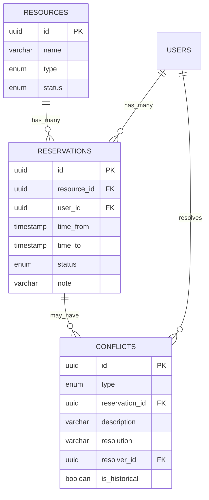

# PRD — Technical Blueprint — Rezervace sdílených zdrojů
## Verze: v1 | Tier: Lean | Jazyk: CZ | Projekt: Rezervace_zdroju

---

## Kapitola 1 — Přehled projektu

### 1.1 Účel
Technická specifikace rezervačního systému sdílených zdrojů (zasedačky, auto, zařízení) pro malý hybridní tým (10–20 lidí). Systém nahrazuje neefektivní koordinaci přes kalendář a domluvu.

### 1.2 Scope MVP
- 5 Use Casů: zobrazení dostupnosti, rezervace, zrušení, evidence konfliktů, správa zdrojů
- 2 role: Uživatel, Správce
- 3 entity: Zdroj, Rezervace, Konflikt
- Responsive web (mobile-first)
- Jeden tenant, žádné integrace, žádné finance

### 1.3 Reference
- PAB: `PAB_Rezervace_zdroju_v1.md`
- UAT: `UAT_Rezervace_zdroju_v1.md`

---

## Kapitola 2 — Funkční požadavky

| ID | Popis | Priorita | source_use_case_id | source_ui_screen_id | source_scenario_ids | api_endpoint | db_tables |
|----|-------|----------|-------------------|--------------------|--------------------|-------------|-----------|
| FR-01 | Systém zobrazí kalendářový přehled dostupnosti všech zdrojů pro zvolený rozsah dat. | MUST | UC-01 | SCR-01_Dashboard | SC-01.1, SC-01.2 | GET /api/resources/availability | resources, reservations |
| FR-02 | Systém umožní uživateli vytvořit rezervaci na volný slot. Ověří INV-01 atomicky (check+insert v jedné transakci). | MUST | UC-02 | SCR-02_Rezervace | SC-02.1, SC-02.2, SC-02.3 | POST /api/reservations | reservations |
| FR-03 | Systém umožní uživateli zrušit vlastní rezervaci (stav vytvořena/aktivní). Správce může zrušit libovolnou. | MUST | UC-03 | SCR-02_Rezervace, SCR-03_MojeRezervace | SC-03.1, SC-03.2 | DELETE /api/reservations/:id | reservations |
| FR-04 | Systém umožní správci evidovat konflikt (no-show, neoprávněné užití, dvojitá rezervace) s povinným popisem a řešením. Evidence je neměnná (INV-05). | MUST | UC-04 | SCR-05_EvidenceKonfliktu | SC-04.1, SC-04.2 | POST /api/conflicts | conflicts, reservations |
| FR-05 | Systém umožní správci přidávat, upravovat a deaktivovat zdroje. Smazání zdroje s aktivními rezervacemi je zakázáno. | MUST | UC-05 | SCR-04_SpravaZdroju | SC-05.1, SC-05.2 | POST/PUT/PATCH /api/resources | resources |
| FR-06 | Systém odmítne rezervaci více než 14 dní dopředu. | MUST | UC-02 | SCR-02_Rezervace | SC-02.3 | POST /api/reservations (validace) | — |
| FR-07 | Systém zobrazí uživateli seznam jeho vlastních rezervací (aktivní, nadcházející, minulé). | MUST | UC-01 | SCR-03_MojeRezervace | SC-01.1 | GET /api/reservations/my | reservations |

---

## Kapitola 3 — Nefunkční požadavky

| ID | Požadavek | Metrika |
|----|-----------|---------|
| NFR-01 | Systém musí být jednoduchý — max 3 tapy na mobilu k vytvoření rezervace. | ≤ 3 interakce od otevření do potvrzení. |
| NFR-02 | Mobilní přístup — responsive web fungující na viewportu 375px. | 100 % CORE flows na 375px. |
| NFR-03 | Odezva API < 500ms pro CORE operace. | p95 < 500ms. |

---

## Kapitola 4 — Datový model

### 4.1 Entity a atributy

**resources**

| Sloupec | Typ | Nullable | PII | Poznámka |
|---------|-----|----------|-----|----------|
| id | UUID | NOT NULL | Ne | PK |
| name | VARCHAR(100) | NOT NULL | Ne | Unique |
| type | ENUM('zasedačka','auto','zařízení') | NOT NULL | Ne | |
| description | VARCHAR(300) | NULL | Ne | |
| status | ENUM('aktivní','neaktivní') | NOT NULL | Ne | Default: 'aktivní' |
| created_at | TIMESTAMP | NOT NULL | Ne | UTC |
| updated_at | TIMESTAMP | NOT NULL | Ne | UTC |

**reservations**

| Sloupec | Typ | Nullable | PII | Poznámka |
|---------|-----|----------|-----|----------|
| id | UUID | NOT NULL | Ne | PK |
| resource_id | UUID | NOT NULL | Ne | FK → resources.id |
| user_id | UUID | NOT NULL | Ne | FK → users.id |
| time_from | TIMESTAMP | NOT NULL | Ne | UTC, >= now |
| time_to | TIMESTAMP | NOT NULL | Ne | UTC, > time_from, max 8h |
| status | ENUM('vytvořena','aktivní','dokončena','zrušena','no_show','konflikt') | NOT NULL | Ne | Default: 'vytvořena' |
| note | VARCHAR(200) | NULL | Ne | |
| created_at | TIMESTAMP | NOT NULL | Ne | UTC |
| updated_at | TIMESTAMP | NOT NULL | Ne | UTC |

**conflicts**

| Sloupec | Typ | Nullable | PII | Poznámka |
|---------|-----|----------|-----|----------|
| id | UUID | NOT NULL | Ne | PK |
| type | ENUM('no_show','neoprávněné_užití','dvojitá_rezervace') | NOT NULL | Ne | |
| reservation_id | UUID | NULL | Ne | FK → reservations.id |
| description | VARCHAR(500) | NOT NULL | Ne | Min 10 znaků |
| resolution | VARCHAR(500) | NOT NULL | Ne | |
| resolver_id | UUID | NOT NULL | Ne | FK → users.id (Správce) |
| is_historical | BOOLEAN | NOT NULL | Ne | Default: false |
| created_at | TIMESTAMP | NOT NULL | Ne | UTC, neměnné (INV-05) |

**users** (zjednodušeno — Lean)

| Sloupec | Typ | Nullable | PII | Poznámka |
|---------|-----|----------|-----|----------|
| id | UUID | NOT NULL | Ne | PK |
| name | VARCHAR(100) | NOT NULL | Ano | |
| email | VARCHAR(255) | NOT NULL | Ano | Unique |
| role | ENUM('uživatel','správce') | NOT NULL | Ne | |
| created_at | TIMESTAMP | NOT NULL | Ne | UTC |

### 4.2 ER Diagram



---

## Kapitola 5 — API specifikace

### 5.1 Endpointy

| Metoda | Endpoint | Popis | Auth | RBAC |
|--------|----------|-------|------|------|
| GET | /api/resources/availability?from=&to= | Přehled dostupnosti | Ano | Uživatel, Správce |
| POST | /api/reservations | Vytvoření rezervace | Ano | Uživatel, Správce |
| DELETE | /api/reservations/:id | Zrušení rezervace | Ano | Vlastník nebo Správce |
| GET | /api/reservations/my | Moje rezervace | Ano | Uživatel (vlastní) |
| POST | /api/conflicts | Evidence konfliktu | Ano | Správce |
| POST | /api/resources | Přidání zdroje | Ano | Správce |
| PUT | /api/resources/:id | Úprava zdroje | Ano | Správce |
| PATCH | /api/resources/:id | Deaktivace zdroje | Ano | Správce |

### 5.2 Autentizace & autorizace
- **auth_transport:** Bearer token (JWT)
- **rbac_required:** Ano — role v tokenu
- **pagination_required:** Ano pro GET /api/reservations/my (kolekce)

---

## Kapitola 6 — Bezpečnost (Lean: zkrácená)

- Autentizace: JWT, expiry 24h
- Autorizace: RBAC na úrovni endpointu (role z tokenu)
- PII: users.name, users.email — maskování v logech
- INV-05: conflicts tabulka je append-only (no DELETE, no UPDATE na created_at)

---

## Kapitola 7 — Invarianty a validace

| ID | Pravidlo | Implementace |
|----|----------|-------------|
| INV-01 | Zdroj nesmí mít dvě překrývající se rezervace (stav "vytvořena" nebo "aktivní") | DB constraint: EXCLUDE USING gist (resource_id WITH =, tsrange(time_from, time_to) WITH &&) WHERE status IN ('vytvořena','aktivní') |
| INV-02 | No-show timeout 60 min | Cron job / scheduled task: reservations WHERE status='vytvořena' AND time_from + 60min < now() → SET status='no_show' |
| INV-03 | Každé užití musí mít platnou rezervaci | Aplikační logika (manuální evidence správcem) |
| INV-04 | Každý konflikt musí skončit v definovaném stavu | Aplikační logika + fallback timeout |
| INV-05 | Historie evidence neměnná | DB: no DELETE/UPDATE trigger na conflicts, audit trail |

---

## Kapitola 8 — Infrastruktura (Lean: zkrácená)

- **Prostředí:** Single instance, PostgreSQL, Node.js/Next.js
- **Deploy:** Vercel (frontend) + managed DB (Supabase/Neon)
- **Monitoring:** Základní health check endpoint

---

## Kapitola 9 — Deployment (Lean: zkrácená)

- CI/CD: GitHub Actions → Vercel auto-deploy
- Environments: staging + production
- DB migrace: schema migrations v repo

---

## Kapitola 10 — Testovací strategie (Lean: zkrácená)

- Unit testy: INV-01 (race condition), INV-02 (timeout), validace vstupů
- Integration testy: API endpointy (happy path + error flows)
- E2E: SC-02.1 (vytvoření rezervace), SC-02.2 (souběh)

---

## Kapitola 11 — Rizika implementace (Lean: zkrácená)

| Riziko | Mitigace |
|--------|----------|
| Race condition na INV-01 | DB-level exclusive constraint (ne app-level check) |
| Cron job pro INV-02 selže | Fallback: manuální evidence správcem (KCS-02) |
| JWT expiry uprostřed operace | Refresh token flow |

---

## Kapitola 12 — Backlog

Žádné PAB_GAP položky — Lean scope je kompletní.

---

## Kapitola 13 — Architecture Decision Records

### ADR-01: PostgreSQL s exclusion constraint pro INV-01
**Kontext:** Potřebujeme atomicky zamezit překrývajícím se rezervacím.
**Rozhodnutí:** Použijeme PostgreSQL GiST exclusion constraint na tsrange — DB garantuje konzistenci bez app-level locku.
**Důsledek:** Závislost na PostgreSQL (ne SQLite/MySQL).

### ADR-02: Cron job pro automatické no-show (INV-02)
**Kontext:** Rezervace ve stavu "vytvořena", u které uplynul čas + 60 min, musí přejít do no_show.
**Rozhodnutí:** Scheduled task (cron) běžící každých 5 min kontroluje expired reservations.
**Důsledek:** Max 5 min prodleva mezi skutečným no-show a systémovým přechodem.

### ADR-03: JWT + RBAC pro autentizaci
**Kontext:** Dva typy uživatelů s odlišnými oprávněními.
**Rozhodnutí:** JWT token s role claim, RBAC middleware na API úrovni.
**Důsledek:** Jednoduché, stateless, škálovatelné.

---

## Self-check

- [x] 13 kapitol přítomno
- [x] Každý FR má source_use_case_id, source_ui_screen_id, source_scenario_ids, api_endpoint, db_tables
- [x] DB model: is_pii u sloupců, UTC časy, UUID klíče
- [x] API: auth_transport, rbac_required, pagination_required
- [x] Lean: jen MUST funkcionalita, Kap. 8–11 zkrácené, 3 ADR
- [x] Česká diakritika v MACHINE_DATA
- [x] Žádný backlog (Lean scope kompletní)

---

## MACHINE_DATA
```json
{
  "_meta": {"project_id": "Rezervace_zdroju", "agent": "prd_tech_blueprint", "version": "v1", "iteration": 1},
  "functional_requirements": [
    {"id": "FR-01", "description": "Zobrazení kalendářového přehledu dostupnosti všech zdrojů.", "priority": "MUST", "source_use_case_id": "UC-01", "source_ui_screen_id": "SCR-01_Dashboard", "source_scenario_ids": ["SC-01.1", "SC-01.2"], "api_endpoint": "GET /api/resources/availability", "db_tables": ["resources", "reservations"]},
    {"id": "FR-02", "description": "Vytvoření rezervace s atomickým ověřením INV-01.", "priority": "MUST", "source_use_case_id": "UC-02", "source_ui_screen_id": "SCR-02_Rezervace", "source_scenario_ids": ["SC-02.1", "SC-02.2", "SC-02.3"], "api_endpoint": "POST /api/reservations", "db_tables": ["reservations"]},
    {"id": "FR-03", "description": "Zrušení vlastní rezervace (správce libovolné).", "priority": "MUST", "source_use_case_id": "UC-03", "source_ui_screen_id": "SCR-02_Rezervace, SCR-03_MojeRezervace", "source_scenario_ids": ["SC-03.1", "SC-03.2"], "api_endpoint": "DELETE /api/reservations/:id", "db_tables": ["reservations"]},
    {"id": "FR-04", "description": "Evidence konfliktu správcem s povinným popisem a řešením. Neměnná (INV-05).", "priority": "MUST", "source_use_case_id": "UC-04", "source_ui_screen_id": "SCR-05_EvidenceKonfliktu", "source_scenario_ids": ["SC-04.1", "SC-04.2"], "api_endpoint": "POST /api/conflicts", "db_tables": ["conflicts", "reservations"]},
    {"id": "FR-05", "description": "CRUD operace nad zdroji (pouze správce). Smazání se zakázáno při aktivních rezervacích.", "priority": "MUST", "source_use_case_id": "UC-05", "source_ui_screen_id": "SCR-04_SpravaZdroju", "source_scenario_ids": ["SC-05.1", "SC-05.2"], "api_endpoint": "POST/PUT/PATCH /api/resources", "db_tables": ["resources"]},
    {"id": "FR-06", "description": "Validace: rezervace max 14 dní dopředu.", "priority": "MUST", "source_use_case_id": "UC-02", "source_ui_screen_id": "SCR-02_Rezervace", "source_scenario_ids": ["SC-02.3"], "api_endpoint": "POST /api/reservations", "db_tables": []},
    {"id": "FR-07", "description": "Seznam vlastních rezervací uživatele.", "priority": "MUST", "source_use_case_id": "UC-01", "source_ui_screen_id": "SCR-03_MojeRezervace", "source_scenario_ids": ["SC-01.1"], "api_endpoint": "GET /api/reservations/my", "db_tables": ["reservations"]}
  ],
  "database_model": {
    "tables": ["resources", "reservations", "conflicts", "users"],
    "pii_columns": ["users.name", "users.email"]
  },
  "api_specification": {
    "auth_transport": "Bearer JWT",
    "rbac_required": true,
    "pagination_required": true,
    "endpoints_count": 8
  },
  "non_functional_requirements": [
    {"id": "NFR-01", "requirement": "Max 3 tapy k rezervaci na mobilu.", "metric": "≤ 3 interakce"},
    {"id": "NFR-02", "requirement": "Responsive web na 375px.", "metric": "100 % CORE flows"},
    {"id": "NFR-03", "requirement": "API odezva < 500ms.", "metric": "p95 < 500ms"}
  ],
  "architecture_decisions": [
    {"id": "ADR-01", "title": "PostgreSQL s exclusion constraint pro INV-01", "decision": "DB-level GiST constraint na tsrange zamezí překrývajícím se rezervacím atomicky."},
    {"id": "ADR-02", "title": "Cron job pro automatické no-show (INV-02)", "decision": "Scheduled task každých 5 min kontroluje expired reservations."},
    {"id": "ADR-03", "title": "JWT + RBAC pro autentizaci", "decision": "JWT token s role claim, RBAC middleware na API úrovni."}
  ],
  "backlog_gaps": []
}
```
